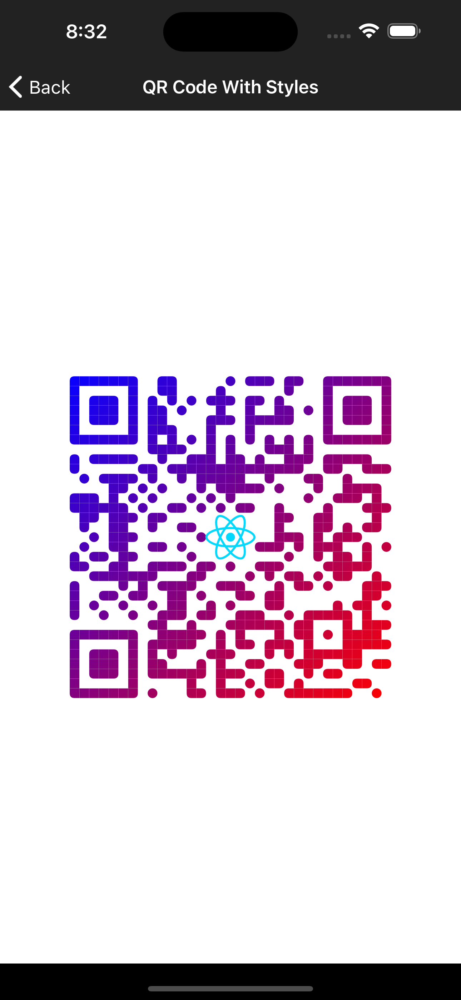
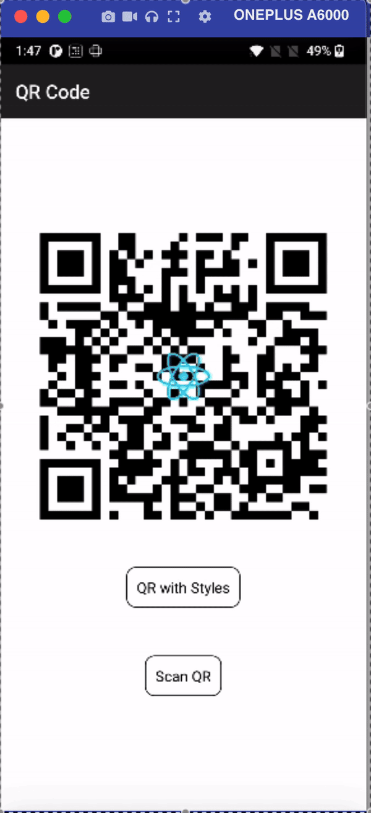

# React Native QR Code (Generate and Scan)

This is a PoC on creating a QR code generation and scanning using the following libraries:

## Libraries Used

1. [`react-native-qr-svg`](https://github.com/exzos28/react-native-qr-svg)
2. [`react-native-qrcode-svg`](https://github.com/Expensify/react-native-qrcode-svg)
3. [`react-native-vision-camera`](https://react-native-vision-camera.com/)
4. [`react-native-svg`](https://github.com/react-native-community/react-native-svg)

 

We are using `react-native-qr-svg` and `react-native-qrcode-svg` for generation of QR code. `react-native-svg` is used as a dependency by both of these libraries.

`react-native-qr-svg` is used to create `QRCodeStyled.tsx` component where the generated QR code has a gradient layout along with brand icon in the middle.

 

`react-native-qrcode-svg` is used to create `QRCode.tsx` component where the generated QR code is plain and simple along with an icon in middle.

 

> **Note:** `react-native-qrcode-svg` is looking out for maintainers and is currently picked up by Expensify.

 

`react-native-vision-camera` is used in `ScanCode.tsx` component which scans a QR code and prints an output for it. When the scanning is successful the camera stops, the device vibrates and moves to the previous screen.

## Working

1. Created a string for QR code that can be opened from the native camera application.
2. The scheme for this string is `qrpay://` and it contains details like payment address, name and amount.
3. Here we have used the string as `qrpay://pa=test@hdfcbank&pn=Test%20Name&am=100` where pa is payment address, pn is payee name and am is amount.
4. This string is URL encoded.
5. When the camera scans this QR code the text is then parsed to extract these details and is then displayed as an alert.

 

 

> **Note:** Not all android devices may support opening the application directly after scanning the QR code from the native camera application.
